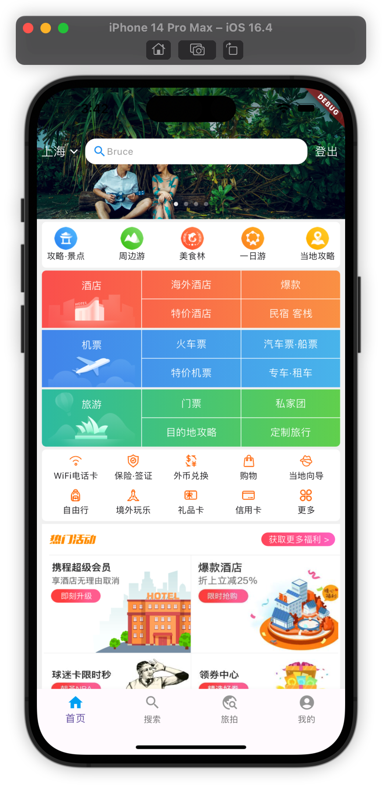
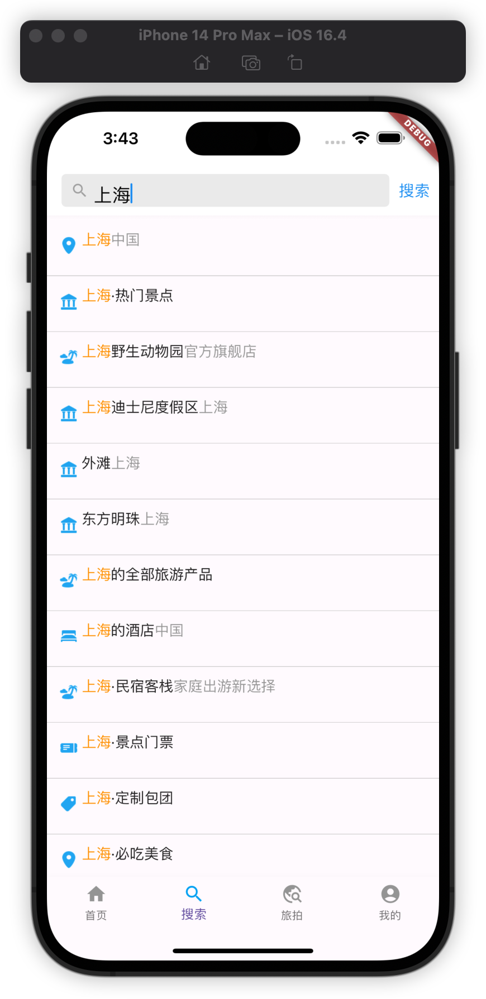
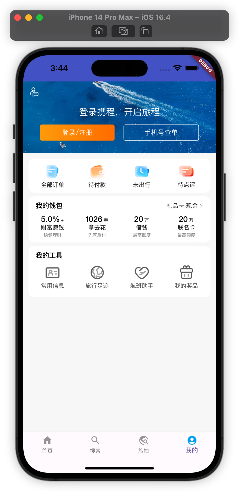

<!--
 * @Date: 2024-03-07 10:12:55
 * @Author: Bruce Hsu
 * @Description: 
-->
<a href="https://flutter.dev/">
  <h1 align="center">
    <picture>
      <source media="(prefers-color-scheme: dark)" srcset="https://storage.googleapis.com/cms-storage-bucket/6e19fee6b47b36ca613f.png">
      
    </picture>
  </h1>
</a>

Welcome to Trip, the ultimate trip app which helps you navigate the world with ease.
This flutter project is designed to offer a seamless and intuitive user interface with four key tabs.

## Documentation

* [Install Flutter](https://flutter.dev/get-started/)
* [Flutter documentation](https://docs.flutter.dev/)
* [Development wiki](https://github.com/flutter/flutter/wiki)
* [Contributing to Flutter](https://github.com/flutter/flutter/blob/master/CONTRIBUTING.md)

## Getting Started

To run this project on your local machine, follow these simple steps:

1. Clone the repository to your local machine.
2. Open the project in your preferred IDE(e.g. Android Studio).
3. Install all the required dependencies using the Flutter package manager(flutter pub get).
4. Start the emulator or connect your device.
5. Run the app to start exploring the world with Trip.

## Home Page & Search Page & Discovery Page & My Page

### Home Tab
- **Navigation Bar**: A clean and accessible navigation bar at the bottom of the home screen allows you to quickly switch between the app's main features.
- **Featured Destinations**: Scroll through an enticing list of featured destinations to inspire your next journey.

### Search Tab

- **Search Functionality**: A robust search feature lets you find specific destinations, hotels, or activities.
- **Suggestions**: As you type, get instant suggestions to help you complete your query.

### Discovery Tab

- **Waterfall Layout**: Explore a waterfall flow of travel experiences and stories shared by other users.
- **Interactive Posts**: Engage with the community by liking, commenting, and sharing posts that catch your eye.

### Profile Tab

- **Login Interface**: Securely log in to access personalized features and sync your travel data across devices.
- **User Profile**: View and edit your profile information, check your travel history, and manage your settings.

### My Page

- **Personalized Content**: See a dashboard of your travel statistics, upcoming trips, and saved destinations.
- **Settings**: Customize your app experience by adjusting settings to fit your travel preferences.